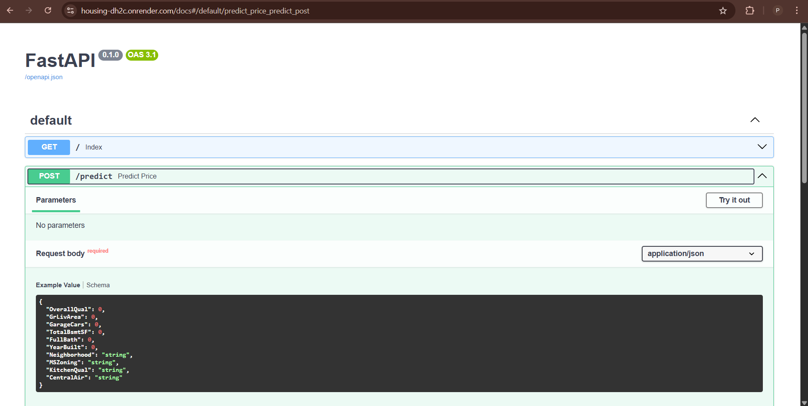

<h1> 🚢 Titanic Survival Prediction</h1>

This project predicts whether a passenger survived the Titanic disaster or not using **Logistic Regression**.  
It is deployed with:  
- **Frontend (Streamlit)** → https://house-pricingprediction.streamlit.app/ 
- **Backend (FastAPI)** → https://housing-dh2c.onrender.com/

---

## 📌 Features
- Linear Regression model trained on Titanic dataset  
- REST API built with **FastAPI**  
- Interactive UI built with **Streamlit**  
- Backend and Frontend are deployed separately  

---

## 🗂️ Project Structure

```text
Housing_prediction/
├── backend/
│   ├── main.py             # FastAPI app (API endpoints)
│   ├── requirements.txt    # Dependencies for backend
│   ├── start.sh            # Startup script
│   ├── housing_model.pkl   # Trained Logistic Regression model
│   └── train.py            # Model training script
├── frontend/
    ├── index.py            # Streamlit app
    └── requirements.txt    # Dependencies for frontend


```

<h3>⚙️ Installation & Setup (Local)</h3>

1️⃣ Clone the repository
bash
Copy code
git clone https://github.com/your-username/Housing.git
cd Titanic_ship

2️⃣ Setup Backend (FastAPI)
bash
Copy code
cd backend
pip install -r requirements.txt
uvicorn main:app --reload --host 0.0.0.0 --port 8081
Backend will be live at:
👉 http://127.0.0.1:8081 (locally)
👉 /docs for Swagger UI

3️⃣ Setup Frontend (Streamlit)

bash
Copy code
cd ../frontend
pip install -r requirements.txt
streamlit run index.py
Frontend will be live at:
👉 http://localhost:8501

📡 API Endpoints
Base URL (Render): https://housing-dh2c.onrender.com/

GET / → Root endpoint

POST /predict → Predict survival

Example Request
json
Copy code
{
  "OverallQual": 0,
  "GrLivArea": 0,
  "GarageCars": 0,
  "TotalBsmtSF": 0,
  "FullBath": 0,
  "YearBuilt": 0,
  "Neighborhood": "string",
  "MSZoning": "string",
  "KitchenQual": "string",
  "CentralAir": "string"
}
Example Response
json
Copy code
{
  "predicted_price": 24582.422912510083
}

<h4>🎨 Frontend (Streamlit)</h4>
The Streamlit UI allows users to:

Select Overall Quality rating (1-10),Total Basement Area (sq ft),Year of Last Remodeled,Above Ground Living Area (sq ft),Full Bathrooms(0-4),Neighborhood,Garage Capacity (Cars),Year Built,Kitchen Quality,Central Air,MS Zoning


Get prediction on whether the passenger survived

<h4>Deployed app: Streamlit cloud</h4>

<h3>📊 Screenshots</h3>
<p align="center">   </p>
🚀 Deployment

Backend → Hosted on Render (uvicorn main:app --host 0.0.0.0 --port 8081)

Frontend → Hosted on Streamlit Cloud

<h3>📊 Model</h3>

Algorithm: Linear Regression

Trained on Housing dataset (Kaggle)

Features: Overall Quality rating (1-10),Total Basement Area (sq ft),Year of Last Remodeled,Above Ground Living Area (sq ft),Full Bathrooms(0-4),Neighborhood,Garage Capacity (Cars),Year Built,Kitchen Quality,Central Air,MS Zoning


