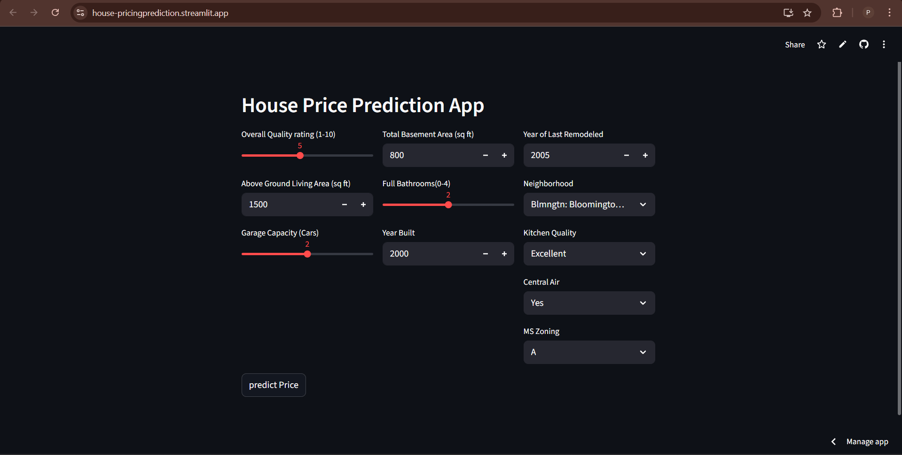

# 🏡 Housing Pricing Prediction

This project predicts the **price of a house** based on various features using **Linear Regression**.
It is deployed with:

* **Frontend (Streamlit)** → [https://house-pricingprediction.streamlit.app/](https://house-pricingprediction.streamlit.app/)
* **Backend (FastAPI)** → [https://housing-dh2c.onrender.com/](https://housing-dh2c.onrender.com/)

---

## 📌 Features

* Linear Regression model trained on the **Housing dataset** (Kaggle)
* REST API built with **FastAPI**
* Interactive UI built with **Streamlit**
* Backend and Frontend are deployed separately

---

## 🗂️ Project Structure

```text
Housing_prediction/
├── backend/
│   ├── main.py             # FastAPI app (API endpoints)
│   ├── requirements.txt    # Dependencies for backend
│   ├── start.sh            # Startup script
│   ├── housing_model.pkl   # Trained Linear Regression model
│   └── train.py            # Model training script
├── frontend/
│   ├── index.py            # Streamlit app
│   └── requirements.txt    # Dependencies for frontend
```

---

## ⚙️ Installation & Setup (Local)

### 1️⃣ Clone the repository

```bash
git clone https://github.com/your-username/Housing_prediction.git
cd Housing_prediction
```

### 2️⃣ Setup Backend (FastAPI)

```bash
cd backend
pip install -r requirements.txt
uvicorn main:app --reload --host 0.0.0.0 --port 8081
```

Backend will be live at:
👉 [http://127.0.0.1:8081](http://127.0.0.1:8081) (locally)
👉 `/docs` for Swagger UI

### 3️⃣ Setup Frontend (Streamlit)

```bash
cd ../frontend
pip install -r requirements.txt
streamlit run index.py
```

Frontend will be live at:
👉 [http://localhost:8501](http://localhost:8501)

---

## 📡 API Endpoints

**Base URL (Render):** [https://housing-dh2c.onrender.com/](https://housing-dh2c.onrender.com/)

* `GET /` → Root endpoint
* `POST /predict` → Predict house price

### Example Request

```json
{
  "OverallQual": 7,
  "GrLivArea": 1800,
  "GarageCars": 2,
  "TotalBsmtSF": 1000,
  "FullBath": 2,
  "YearBuilt": 2005,
  "Neighborhood": "CollgCr",
  "MSZoning": "RL",
  "KitchenQual": "Gd",
  "CentralAir": "Y"
}
```

### Example Response

```json
{
  "predicted_price": 24582.42
}
```

---

## 🎨 Frontend (Streamlit)

The Streamlit UI allows users to input:

* Overall Quality rating (1–10)
* Total Basement Area (sq ft)
* Above Ground Living Area (sq ft)
* Full Bathrooms (0–4)
* Neighborhood
* Garage Capacity (Cars)
* Year Built
* Kitchen Quality
* Central Air
* MS Zoning

and get a **predicted house price** instantly.

---

## 📊 Screenshots

<p align="center">
  
  
</p>

---

## 🚀 Deployment

* **Backend** → Hosted on Render (`uvicorn main:app --host 0.0.0.0 --port 8081`)
* **Frontend** → Hosted on Streamlit Cloud

---

## 📊 Model

* **Algorithm**: Linear Regression
* **Dataset**: Housing dataset (Kaggle)
* **Features**:

  * Overall Quality rating (1–10)
  * Total Basement Area (sq ft)
  * Above Ground Living Area (sq ft)
  * Full Bathrooms (0–4)
  * Neighborhood
  * Garage Capacity (Cars)
  * Year Built
  * Kitchen Quality
  * Central Air
  * MS Zoning
